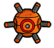
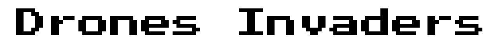

  
   
  

      

## Présentation
Drones Invaders est un jeu d'arcade consistant à esquiver les drones ennemis et leur tirer dessus.

## Jouer au jeu
Vous pouvez y jouer directement sur navigateur : https://daymortel.itch.io/drones-invaders

Ou le télécharger dans les [Releases](https://github.com/Daymortel/drones-invaders/releases)

## Crédits

Game Design original : Daymortel

Développement : Daymortel et <a href="https://github.com/djalexkidd">djalexkidd</a>
